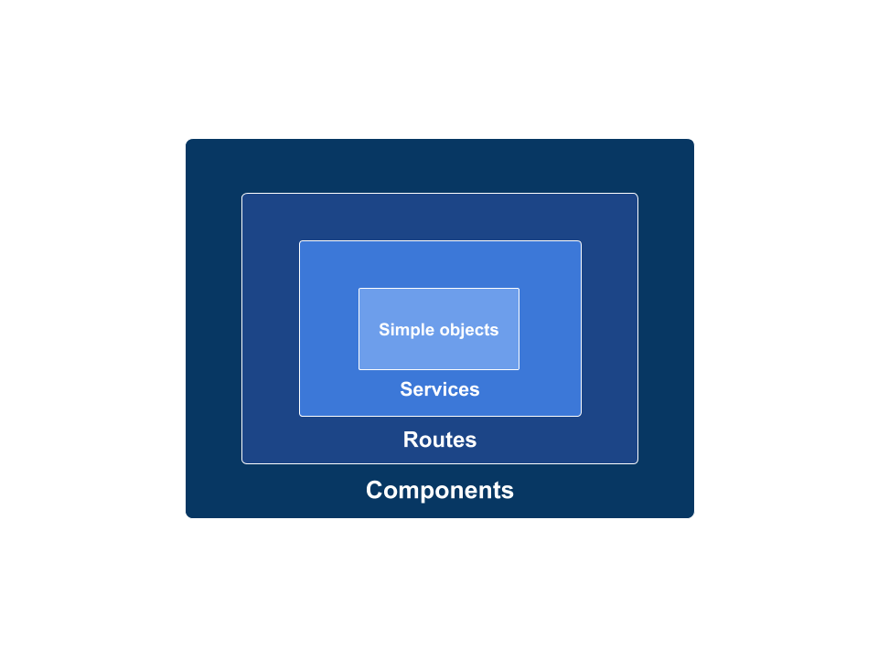

# ember-es6-class-codemod

A collection of codemod's for ember-es6-class-codemod.

## Usage

To run a specific codemod from this project, you would run the following:

```
npx ember-es6-class-codemod <TRANSFORM NAME> path/of/files/ or/some**/*glob.js

# or

yarn global add ember-es6-class-codemod
ember-es6-class-codemod <TRANSFORM NAME> path/of/files/ or/some**/*glob.js
```

## Transforms

The transforms are tiered starting with simple ember objects to the complex ones including decorators and/or mixins etc. The codemods can be run targeting only specific types. For example it is possible to run the codemods targeting only `services` or `routes` in the app code.

The codemods are grouped as following

1. Simple objects (codemod: `simple-objects`)
2. Services (codemod: `services`)
3. Class helpers (codemod: `class-helpers`)
4. Routes (codemod: `routes`)
5. Components (codemod: `components`)
6. Controllers (codemod: `controllers`)
7. Routers (codemod: `routers`)

At each level, the codemods handles the transforms for all previous levels and add some new transforms specific to that level. For example, codemods for `routes` will handle transforms for `services` and `simple object` and add new support for transforming `actions`. This can be illustrated with picture below:



### Simple ember objects

| Before                                        | After                                     |
| --------------------------------------------- | ----------------------------------------- |
| const SimpleObject = EmberObject.extend({});  | class SimpleObject extends EmberObject {} |
| const simpleObj = SimpleObject.create();      | const simpleObj = new SimpleObject();     |
| property: value,                              | property = value;                         |
| method() { this.\_super(...arguments); }      | method() { super.method(...arguments); }  |
| cp: computed('p1', 'p2', function () { ... }) | @computed('p1', 'p2')<br> cp() { ... }    |
| ob: observer('p1', 'p2', function () { ... }) | @observes('p1', 'p2')<br>ob() { ... }     |
| ev: on('click', function() { ... })           | @on('click')<br>ev() { ... }              |

For detailed examples please see `test-fixtures` in `simple-object` transform

### Services

In addition to simple object transforms, `service-transform` will do following:

| Before                                | After                              |
| ------------------------------------- | ---------------------------------- |
| const MyService = Service.extend({}); | class MyService extends Service {} |

### Class helpers (Haven't seen any example of this)

| Before | After |
| ------ | ----- |


### Routes

In addition to above mentioned transforms `route-transform` will do following

| Before                            | After                           |
| --------------------------------- | ------------------------------- |
| const MyRoute = Route.extend({}); | class MyRoute extends Route {}  |
| actions: { someAction() { ... }}  | @action<br>someAction() { ... } |

### Components

In addition to above mentioned transforms `controller-transform` will do following

| Before                                                                     | After                                                    |
| -------------------------------------------------------------------------- | -------------------------------------------------------- |
| const MyComponent = Component.extend({});                                  | class MyComponent extends Component {}                   |
| const C = Component.extend({ tagName: 'div' });                            | @tagName('div)<br> class C extends Component {}          |
| const C = Component.extend({ classNames: ['a', 'b'] });                    | @classNames('a', 'b')<br> class C extends Component {}   |
| classNameBindings: ['isEnabled:enabled:disabled'],<br>isEnabled: false     | @className('enabled', 'disabled')<br>isEnabled = false;  |
| attributeBindings: ['customHref:href']<br>customHref: 'http://emberjs.com' | @attribute('href')<br>customHref = 'http://emberjs.com'; |

### Controllers

| Before                                      | After                                   |
| ------------------------------------------- | --------------------------------------- |
| const MyController = Controller.extend({}); | class MyController extends Controller{} |

Controller transformation would be covered in the above mentioned transforms

### Routers

| Before                              | After                           |
| ----------------------------------- | ------------------------------- |
| const MyRouter = Router.extend({}); | class MyRouter extends Router{} |

Router transformation would be covered in the above mentioned transforms

## Contributing

### Installation

- clone the repo
- change into the repo directory
- `yarn`

### Running tests

- `yarn test`

### Update Documentation

- `yarn update-docs`
